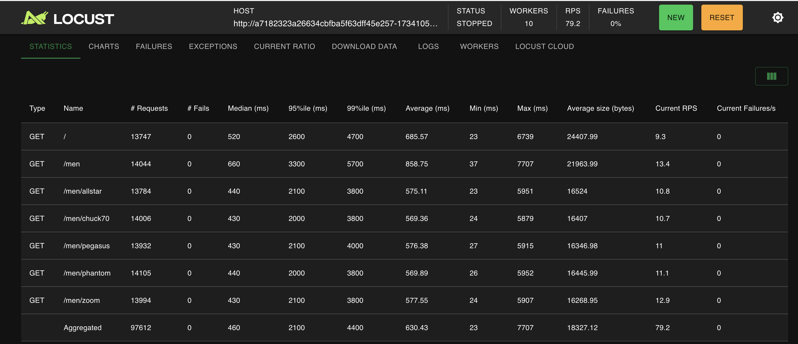

## dbo-ecom-demo

Welcome to dbo ecommerce demo app!!

## Setup Guide

### Step 1 - Deploy ecommerce app & locust load test tool

Update DB & DBO details in configmap (demo-ecom-db-config.yaml)
```
data:
  MAIN_DB: "database-1-instance-1.cvqew6y8w8o0.us-east-2.rds.amazonaws.com"
  DB_HOST: "db-optimizer-postgres-db-88b40-db.castai-db-optimizer.svc.cluster.local"
  DB_PORT: "5432"
  DB_NAME: "postgres"
  DB_USER: "postgres"
  DB_PASSWORD: ""
```
<br>

```
kubectl apply -f demo/

demo-ecom-app can be accessed at http://loadbalancer-ip:3000 
demo-ecom-app admin panel can be accessed at http://loadbalancer-ip:3000/admin 
locust load app can be accessed at http://loadbalancer-ip:8089 

```

### Step 2 - Bootstrap admin user for demo-ecom-app & boostrap mock data

```
kubectl exec -it demo-ecom-app-pod-name -- /bin/sh
ls
./bootstrap.sh
```
You are set to go!!!

## E-COM Demo App


This project is based on https://github.com/evershopcommerce/evershop

## Locust load app

Load Generation config
DB CPU - 0.5 ACU TO 1.5 ACU
No of users at concurrency - 200
Ramp up users - 10




## Troubleshooting FAQ'S

1. Demo app is restarting continously <br>
Check db env vars in connections in demo-ecom-db-config.yaml & db is reachable (check rds sg)

```
data:
  MAIN_DB: "database-1-instance-1.cvqew6y8w8o0.us-east-2.rds.amazonaws.com"
  DB_HOST: "db-optimizer-postgres-db-88b40-db.castai-db-optimizer.svc.cluster.local"
  DB_PORT: "5432"
  DB_NAME: "postgres"
  DB_USER: "postgres"
  DB_PASSWORD: ""
```

2. Add new endpoints to locust to simulate load <br>
 add task with new endpoints to hit in confimap of locust-load.yaml. Restart locust master & workers.

```
        @task
        def get_products(self):
            self.client.get("/men")

        @task
        def get_products_allstar(self):
            self.client.get("/men/allstar")
```

3. Update products data for demo app <br>
Products is bootstrapped using boostrap.sh & updates can be added from it.
