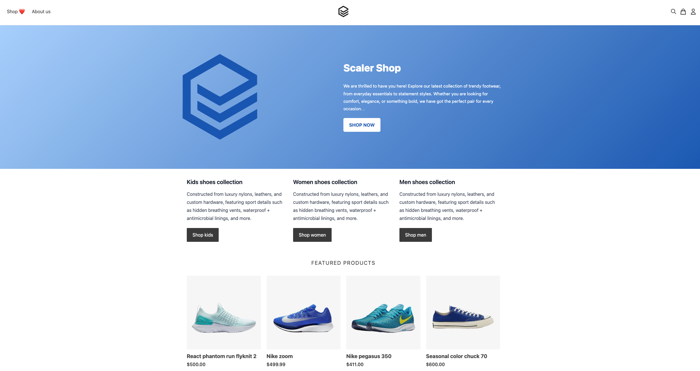

## dbo-ecom-demo

Welcome to dbo ecommerce demo app!!

## Setup Guide

### Step 1 - Deploy ecommerce app & locust load test tool

Update DB details in demo-ecom-app.yaml  
kubectl apply -f demo/  

demo-ecom-app can be accessed at http://loadbalancer-ip:3000  
locust load app can be accessed at http://loadbalancer-ip:8089  

### Step 2 - Setup admin user for demo-ecom-app & boostrap mock data

kubectl exec -it demo-ecom-app-pod-name -- /bin/sh  
npm run user:create -- --email "admin@admin.com" --password "admin123" --name "admin"  

### Step 3 - Update boostrap details & run boostrap.sh

Navigate to boostrap folder  
Update boostrap.vars with vars where mentioned as ## To be added by user  
Execute bootstrap.sh to update products data.  

You are set to go!!!

# E-COM Demo App

This project is based on https://github.com/evershopcommerce/evershop